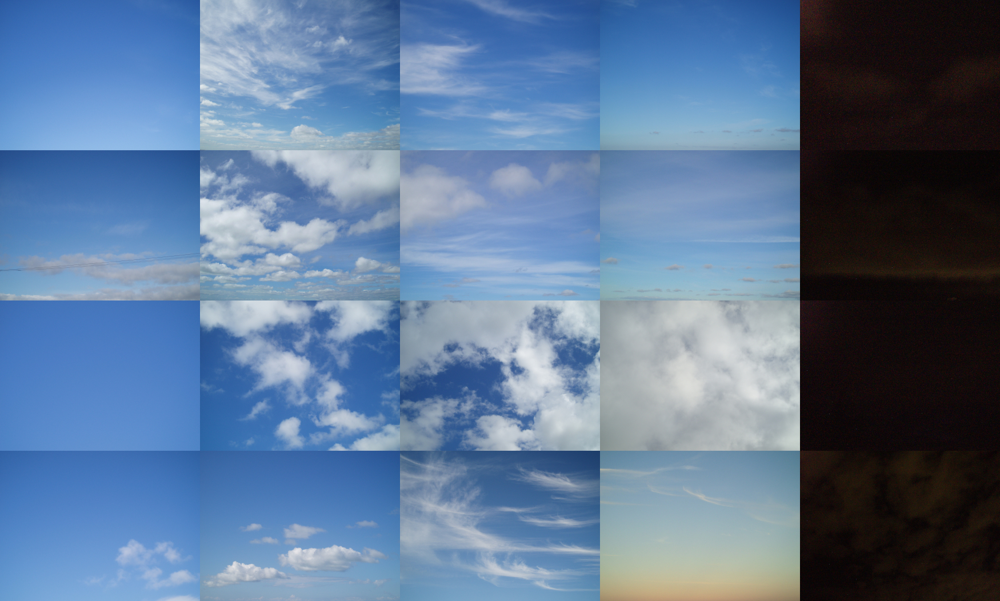

```{r setup, include=FALSE}
knitr::opts_chunk$set(echo=FALSE, fig.width = 6, fig.height = 4, message=FALSE, warning=FALSE, error=FALSE)

library(tidyverse)
library(magick)
```

```{r}
# reading the data from the google sheet
logged_data <- read_csv("https://docs.google.com/spreadsheets/d/e/2PACX-1vSmqjIDhQztogpXEn9VZX_niYjk8_4HCLCYKRmZdiWX47TRrhUm_7zmo6kHNstGNUjvQprt4uZhqfT1/pub?gid=1321805626&single=true&output=csv")

# splitting the first column, as it contains both date and time
# and we might want to use them as separate variables
split_data <- logged_data %>%
  separate(col=Timestamp, into=c('date', 'time'), sep=" ")

# renaming the columns
latest_data <- split_data %>%
  rename(weather_condition = 3,
         wind_strength = 4,
         temp = 5,
         sky_colour = 6,
         any_phenomena = 7,
         phenomena_desc = 8)

# how many observations are logged? 
observations_logged <- nrow(latest_data)

# what is the minimum temperature recorded?
min_temp <- min(latest_data$temp %>% round(1))

# what is the maximum temperature recorded?
max_temp <- max(latest_data$temp %>% round(1))

# what is the mean of the observed temperatures? 
mean_observed_temp <- latest_data$temp %>% mean() %>% round(1)

```


```{css}

/* General body styling */
/* Gradient generator from https://cssgradient.io/ */
body {
    font-family: 'Times New Roman', serif;
    align-items: left;
    color: #414449;
    padding-top: 30px;
    padding-left: 300px;
    padding-right: 300px;
    padding-bottom: 30px;
    background: rgb(139,196,253);
    background: linear-gradient(180deg, rgba(139,196,253,1) 0%, rgba(185,225,255,1) 6%, rgba(223,241,255,1) 12%, rgba(255,255,255,1) 21%, rgba(255,255,255,1) 100%);  
}

/* Header styling */
h1 {
  font-weight: bold;
  text-transform: lowercase;
  text-align: center;
  padding-bottom: 30px;
}

h2, h3, h4 {
  font-weight: bold;
  text-transform: lowercase;
}

/* Resize and center all images * /
/* Note - this overwrites the R code!! */
img {
    display: block;
    margin: 0 auto;
    width: 500px;
}

```

# Weather Logging 

## What's the weather up to? 

For my observational study, I tracked the weather at random times throughout the day; generally whenever I stepped outside. 

These were logged through a Google Form, which included the following questions: 

- What is the current weather condition? 
- What is the current wind strength?
- What is the current temperature in degree Celsius (°C)? 
- What is the approximate colour of the sky? 
- Do you notice any interesting or unusual atmospheric phenomena? 
  - If yes - what do you notice? 

## Summary Values:

There are currently `r observations_logged` observations logged through the form. 

The lowest temperature recorded is `r min_temp`°C, and the highest is `r max_temp`°C. The mean of the observed temperatures is `r mean_observed_temp`°C.

## Bar Charts:

```{r}
# bar graph with the weather conditions
weather_graph <- latest_data %>%
  ggplot() +
  geom_bar(aes(x = weather_condition),
           fill = "#8BC4FD", colour="#FFFFFF") +
  
  # renaming the title/subtitle/axes
  labs(title = "Weather Condition",
       subtitle = "What sort of weather has it been?",
       x = "weather condition",
       y = "occurrence count")
print(weather_graph)
```

```{r}
# bar graph with the wind conditions
wind_graph <- latest_data %>%
  ggplot() +
  geom_bar(aes(x = wind_strength),
           fill = "#8BC4FD", colour="#FFFFFF") +
  
  # renaming the title/subtitle/axes
  labs(title = "Wind Strength",
       subtitle = "What has the wind been like?",
       x = "wind strength",
       y = "occurrence count")
print(wind_graph)
```

```{r}
# vector containing the colours referenced in the key
sky_colours <- c("1" = "#E0E0E0",
                 "2" = "#ECECEC",
                 "3" = "#F4F1EA",
                 "4" = "#B9E1FF",
                 "5" = "#8BC4FD",
                 "6" = "#67A6EE",
                 "7" = "#5079C9",
                 "8" = "#273659",
                 "9" = "#131629",
                 "10" = "#000000")

# sky_colour is considered a numeric value, specifically a double
# however, we want to use it as a categorical value, since it is 
# a key referencing a particular hex colour
# we cannot make a bar graph from numeric values, it wants to be a histogram
# so, we can force the data in sky_colour to become a character value
# and thus be interpreted as categorical by geom_bar()
# by using the function as.character(with sky_colour as the argument)

# bar graph with the sky's colour
colour_graph <- latest_data %>%
  ggplot() +
  geom_bar(aes(x = as.character(sky_colour),
               fill = as.character(sky_colour)), colour="#FFFFFF") +
  
  # manually assigning the fill to the vector sky_colours
  # so, each value passed as a character from sky_colour the column
  # is linked to a hex value in the vector, and that hex value is used to colour the graph
  scale_fill_manual(values = sky_colours, name = "sky colour") +
  
  # renaming the title/subtitle/axes
  labs(title = "Sky Colour",
       subtitle = "What colour has the sky been?",
       x = "sky colour",
       y = "occurrence count")
print(colour_graph)
```

The colours come from a key that was included in the form:


## Pictures:

Not requested in the form, but I also took pictures of all the weather occurrences I logged, and stitched them together with {magick}. Unfortunately, my camera does not handle low-light well...I promise there was nuance in real life. 

```{r}
a <- image_read("wl/1.JPG") %>% image_scale(350)
b <- image_read("wl/2.JPG") %>% image_scale(350)
c <- image_read("wl/3.JPG") %>% image_scale(350)
d <- image_read("wl/4.JPG") %>% image_scale(350)
e <- image_read("wl/5.JPG") %>% image_scale(350)

f <- image_read("wl/6.JPG") %>% image_scale(350)
g <- image_read("wl/7.JPG") %>% image_scale(350)
h <- image_read("wl/8.JPG") %>% image_scale(350)
i <- image_read("wl/9.JPG") %>% image_scale(350)
j <- image_read("wl/10.JPG") %>% image_scale(350)

k <- image_read("wl/11.JPG") %>% image_scale(350)
l <- image_read("wl/12.JPG") %>% image_scale(350)
m <- image_read("wl/13.JPG") %>% image_scale(350)
n <- image_read("wl/14.JPG") %>% image_scale(350)
o <- image_read("wl/15.JPG") %>% image_scale(350)

p <- image_read("wl/16.JPG") %>% image_scale(350)
q <- image_read("wl/17.JPG") %>% image_scale(350)
r <- image_read("wl/18.JPG") %>% image_scale(350)
s <- image_read("wl/19.JPG") %>% image_scale(350)
t <- image_read("wl/20.JPG") %>% image_scale(350)

first <- c(a, b, c, d, e) %>%
  image_append()
second <- c(f, g, h, i, j) %>%
  image_append()
third <- c(k, l, m, n, o) %>%
  image_append()
forth <- c(p, q, r, s, t) %>%
  image_append()

final <- c(first, second, third, forth) %>%
  image_append(stack = TRUE)
image_write(final, "final_image.png")

```


